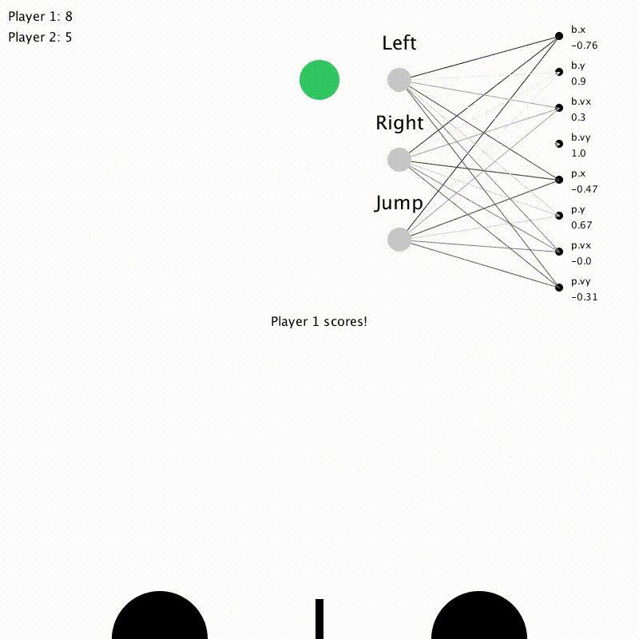

# Slime Volleyball AI
Neural network that plays Slime Volleyball

This neural net was created in my 3rd year of uni at Monash. It plays the simple 2D game Slime Volleyball, wherein two players bounce a ball over a net and try to make it land on their opponent's floor. It uses an evolutionary arms race and reinforcement learning to train itself, and by generation 56 would probably put up a good fight against an inexperienced player.

The project was built in Processing with Python.

Included is a [video summary](NonProcessingFiles/NeuralNetVideo.mp4) of the AI's development.
